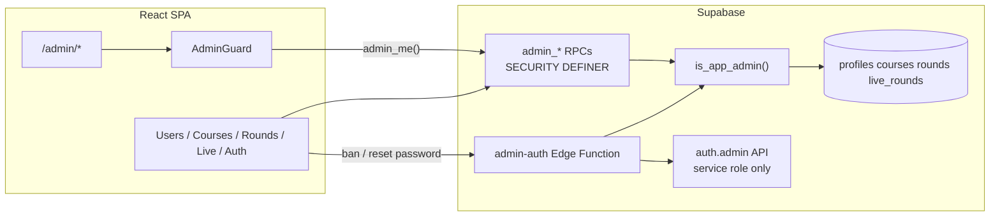

# Admin Dashboard Plan

> **Status:** Saved for later — not implemented yet.  
> **Cursor plan:** `.cursor/plans/admin_dashboard_1d513a72.plan.md`  
> **Created:** June 2025

## Goal

A **solo-operator admin area** inside the existing GoLo app at `/admin` — not linked from tab nav, same design system, full access to users, courses, rounds, live rounds, and auth ops. Only your account can use it; every mutation is verified **server-side**, not just hidden UI.

## Architecture



**Why RPCs, not client `select *`:** Current RLS on `profiles`, `rounds`, and `courses` is strictly own-row / participant-scoped. The anon client cannot list other users today. Admin access must bypass RLS inside controlled functions that check `is_app_admin()` first — same pattern as live-round RPCs in `0009_live_rounds_functions.sql`.

**Why an Edge Function for auth ops:** Disabling users and sending password resets require Supabase **Auth Admin API** + `SUPABASE_SERVICE_ROLE_KEY`. That key must never ship in the Vite bundle.

---

## 1. Database — migration `0010_admin.sql`

Add admin identity and RPC layer:

| Piece | Purpose |
|-------|---------|
| `profiles.is_admin boolean not null default false` | Single source of truth; you bootstrap once via SQL |
| `public.is_app_admin()` | `security definer stable` — `exists (select 1 from profiles where id = auth.uid() and is_admin)` |
| `courses.visible_in_setup boolean not null default false` | Replaces hardcoded `VISIBLE_COURSE_IDS` in `SetupWizard.jsx` |
| Seed backfill | Set `visible_in_setup = true` for `tetherow`, `losttracks`, `pinehurst` |

**Admin RPCs** (all gated by `is_app_admin()`):

- **Users:** `admin_list_profiles(search text, limit, offset)` → id, email, name, nickname, phone, handicap, onboarded, ghin fields, created_at, round_count
- **Users:** `admin_update_profile(p_user_id uuid, p_fields jsonb)` — whitelist keys: name, nickname, email, phone, handicap_index, home_club, venmo, onboarded, notify_live, notify_settle, ghin_sync
- **Courses:** `admin_list_courses()` — full row incl. GHIN + `visible_in_setup`
- **Courses:** `admin_upsert_course(p_course jsonb)` — edit any course including seeded (`created_by` null)
- **Courses:** `admin_set_course_visibility(p_id text, p_visible boolean)`
- **Rounds:** `admin_list_rounds(p_search, p_limit, p_offset)` — join owner email/name, course, date, participant count
- **Rounds:** `admin_get_round(p_id uuid)` — row + participants + snapshot
- **Rounds:** `admin_delete_round(p_id uuid)` — cascade delete (support tool)
- **Live:** `admin_list_live_rounds(p_status text default 'live')` — invite_code, course, scorer, member count, started_at
- **Live:** `admin_force_complete_live_round(p_id uuid)` — reuse logic from `complete_live_round` but admin-authorized
- **Bootstrap:** `admin_me()` → `{ is_admin: boolean }` for client guard

**One-time bootstrap** (run in Supabase SQL editor after deploy):

```sql
update public.profiles set is_admin = true where email = 'YOUR_EMAIL@example.com';
```

No env-var allowlist in the client — the DB flag is authoritative.

---

## 2. Edge Function — `supabase/functions/admin-auth/index.ts`

POST body: `{ action, userId?, email? }`

| Action | Behavior |
|--------|----------|
| `send_password_reset` | `auth.admin.generateLink({ type: 'recovery', email })` — returns success only |
| `ban_user` | `auth.admin.updateUserById(userId, { ban_duration: '876000h' })` or equivalent |
| `unban_user` | Clear ban |
| `get_auth_user` | Read-only: created_at, last_sign_in, email_confirmed, banned |

Flow: validate JWT → load caller profile via service role → reject unless `is_admin` → perform auth action.

---

## 3. Client — routing and guard

| File | Change |
|------|--------|
| `src/App.jsx` | Add lazy route `/admin/*` → `AdminLayout` (inside `MainRoutes`, after auth gate) |
| `src/pages/admin/AdminLayout.jsx` | Desktop canvas (~1080px), left sidebar nav, `<Outlet />` |
| `src/pages/admin/AdminGuard.jsx` | On mount: `admin_me()`; if not admin → `<Navigate to="/" replace />` |
| `src/lib/db/admin.js` | Thin wrappers for all `admin_*` RPCs + edge function calls |
| `src/hooks/useAdmin.js` | `{ isAdmin, loading, error }` for guard |

**No bottom tab entry.** Access via bookmark: `https://gologolf.netlify.app/admin`

---

## 4. UI modules (MVP screens)

Design: reuse tokens from `CLAUDE.md` — glass cards, lime accent, desktop padding.

### Overview (`/admin`)
- KPI cards: total users, users onboarded, active live rounds, rounds completed (last 7 days)
- Quick links to each section

### Users (`/admin/users`)
- Searchable table: name, email, phone, handicap, onboarded, GHIN connected, joined date
- Row click → detail drawer: edit fields, save via `admin_update_profile`
- Link to Auth panel for selected user

### Courses (`/admin/courses`)
- Table: name, location, holes, visible in setup, GHIN mapped?
- Edit form: pars / stroke index / tees, GHIN IDs, background image path
- Toggle **Visible in setup** (replaces `VISIBLE_COURSE_IDS` hardcode)

### Rounds (`/admin/rounds`)
- Filterable table: date, course, owner email, holes, scoring type
- Detail view: participant list + collapsible snapshot JSON
- Delete button with confirm modal

### Live (`/admin/live`)
- Table: invite code, course, status, scorer, members, started_at
- Actions: copy invite URL, **Force finish** for stuck `status = 'live'`

### Auth (`/admin/auth` or tab on user detail)
- Lookup by email / user id
- Actions: Send password reset, Ban / Unban

---

## 5. SetupWizard cleanup

- Remove `VISIBLE_COURSE_IDS` constant; use DB `visible_in_setup`
- Leave `SHOW_COURSE_CARD_EDIT = false` — course editing lives in admin only

---

## 6. Security checklist

- Every `admin_*` RPC starts with `if not public.is_app_admin() then raise exception 'not authorized'`
- Edge function double-checks `is_admin` before service-role calls
- No `/admin` link in UI; RPC gate is the real security
- Do not add INSERT policy on `live_round_members`

---

## 7. Implementation order

1. **Foundation** — `0010_admin.sql`, `admin_me()`, guard, AdminLayout + Overview KPIs
2. **Users + Courses** — catalogue management
3. **Rounds + Live** — support tools + force-complete
4. **Auth Edge Function** — ban/reset; Auth tab on user detail

---

## 8. Verification

- Non-admin → `/admin` redirects to Home
- Your account → `/admin` loads Overview
- Edit course visibility → SetupWizard list updates
- Force-complete live round → viewers get "Round finished" teardown
- Ban test user → cannot sign in; unban restores access

---

## Out of scope (later)

- Multi-admin role management UI
- Audit log table for admin actions
- Live-round PII stripping (separate task)
- In-app course card editor in SetupWizard

---

## Checklist (when ready to build)

- [ ] Add `0010_admin.sql`: is_admin column, is_app_admin(), admin RPCs, courses.visible_in_setup backfill
- [ ] Add AdminGuard, AdminLayout, /admin route, `src/lib/db/admin.js`, Overview KPIs
- [ ] Build Users and Courses admin screens; switch SetupWizard to visible_in_setup filter
- [ ] Build Rounds browser/detail/delete and Live rounds list + force-complete
- [ ] Add admin-auth Edge Function and Auth panel on user detail
- [ ] Document bootstrap SQL; QA with admin vs non-admin accounts
