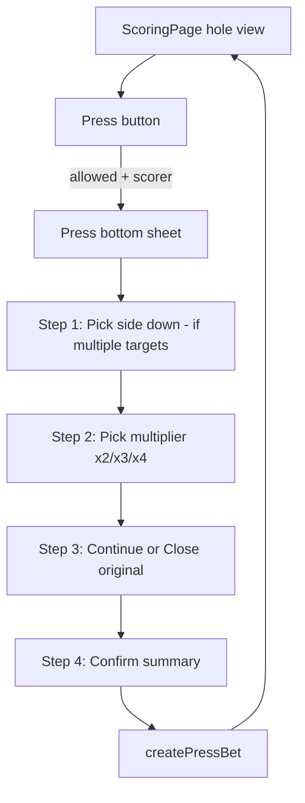

# Go Lo Golf — Press Bet UI Handoff

## Goal

Build the **live scoring UI for manual Press bets** on **Overall Purse** only. All rules, data, and settlement logic already exist — wire UI to them. Do **not** change payout engines unless a bug is found.

---

## Design system (required)

Before designing, open the canonical reference:

- [`Golo Golf - Design System.dc.html`](../Golo%20Golf%20-%20Design%20System.dc.html) — tokens, glass surfaces, type, components

Follow project conventions from [`CLAUDE.md`](../CLAUDE.md):

- **Aesthetic:** glass over turf — course photo + dark scrim + frosted glass
- **Accent:** `#d4f23a` (lime); text on accent `#13250a`
- **Glass card:** `rgba(20,28,24,.5)` + blur, border `rgba(255,255,255,.13)`
- **Bottom sheet:** `rgba(14,20,16,.9)` + blur
- **Type:** system-ui, weights 800/700/600; section labels 11px uppercase
- **Tap targets:** ≥ 48px
- **Phone canvas:** 390×844; match existing [`ScoringPage.jsx`](../src/pages/ScoringPage.jsx) patterns

Reuse existing ScoringPage sub-patterns:

- Bottom sheet shell: `Sheet` component (~line 1143)
- Side-game panels: `WolfPanel`, `SkinsPanel`, `PickerPanel` (~lines 835–877)
- Active bets row: chips above bottom nav (~lines 880–896)
- Active bets detail sheet: `sheet === 'bets'` (~lines 1083–1105)

---

## Product rules (UI must reflect)

A **press** is a new side bet when a player/team is **2+ down** in an Overall Purse match. It starts on the **next hole**, not the current one.

| Rule | Behavior |
|------|----------|
| Game | Overall Purse only (`bet.type === 'overallPurse'`) |
| Who can press | Scoring player only (`!readOnly` — not live viewer/player) |
| Margin | Side must be **2 or more down**; tied or 1 down = no press |
| Match | Must still be active (not clinched) |
| Limit | Max **2 active presses** per Overall Purse bet |
| Last hole | No press on hole 18 of 18 (no “next hole”) |
| Multiplier | x2, x3, or x4 on **original stake** |
| Original bet | User chooses **Continue** or **Close** |
| Close original | Settles Overall Purse **through current hole only**; press runs from next hole |
| Continue original | Original keeps running; press is separate |
| 2 players | Pair inferred automatically |
| 3–4 players | User must pick **which pairing** (target + opponent) |
| Teams (scramble, 2 teams) | Target/opponent are **teams**, not individuals |

**Stake formula**

- `pressStake = originalStake × multiplier`
- If continuing: `totalExposure = originalStake + pressStake`
- If closing original: only press exposure remains for future holes

---

## What’s already built (do not reimplement)

### Setup (done)

Overall Purse is toggled in **Skins setup** with its own stake:

- [`SetupWizard.jsx`](../src/pages/SetupWizard.jsx) — `selectedSkins.overallPurse`, `overallPurseStake`
- On round start, emits bet: `{ type: 'overallPurse', playerIds, amount, config: { stake, style: 'match' } }`

### Engines (done)

| File | Role |
|------|------|
| [`src/engines/pressBets.js`](../src/engines/pressBets.js) | Eligibility, creation, press payouts |
| [`src/engines/overallPurse.js`](../src/engines/overallPurse.js) | Base match-play bet + early closure |
| [`src/engines/betStatus.js`](../src/engines/betStatus.js) | Live Overall Purse pill (`overallPursePill`) |
| [`src/engines/betResults.js`](../src/engines/betResults.js) | Settlement includes press payouts |

### Store (done)

[`src/store/roundStore.js`](../src/store/roundStore.js):

- `pressBets: PressBet[]`
- `createPressBet(input)` → `{ ok, pressBet }` or `{ ok: false, error }`

Live sync: [`src/lib/db/liveRounds.js`](../src/lib/db/liveRounds.js) serializes `pressBets`.

---

## API the UI should call

### 1. Check eligibility (derive button visibility)

```js
import { getPressEligibility } from '../engines/pressBets'

const eligibility = getPressEligibility({
  bets,
  pressBets,
  scores,
  pars: round.pars,
  strokeAllocations: getStrokeAllocations(),
  teams,
  currentHole,
  totalHoles: round.holes ?? 18,
  status: roundStatus, // 'in_progress'
})

// eligibility.allowed  → show Press button
// eligibility.reasons  → disabled tooltip / helper copy
// eligibility.targets  → who can be pressed (see shape below)
```

**`targets` shape (2-player example):**

```js
{ targetPlayerId: 'b', opponentPlayerId: 'a', margin: 3 }
```

**Team example:**

```js
{ targetTeamId: 'teamB', opponentTeamId: 'teamA', margin: 2, label: 'Team B 2 down' }
```

**3–4 players:** multiple targets — user must pick one before confirming.

### 2. Create press (on confirm)

```js
const createPressBet = useRoundStore((s) => s.createPressBet)

const result = createPressBet({
  multiplier: 2, // 2 | 3 | 4
  originalBetAction: 'continue', // 'continue' | 'close'
  createdByPlayerId: meId, // profile-matched player id
  createdByTeamId: null,   // or team id in scramble if relevant
  targetPlayerId,          // side that is down (individual)
  opponentPlayerId,        // required for 3–4 players; auto for 2-player
  // OR for teams:
  targetTeamId,
  opponentTeamId,
})

if (!result.ok) {
  // show result.error toast
} else {
  // success — sheet closes; press syncs via liveRoundSync
}
```

Exported constants: `MAX_ACTIVE_PRESSES` (2), `MULTIPLIERS` ([2,3,4]) from `pressBets.js`.

### 3. Read active presses

```js
const pressBets = useRoundStore((s) => s.pressBets)
// filter: pressBets.filter(p => p.status === 'active')
```

Each `PressBet` includes: `multiplier`, `pressStake`, `originalStake`, `startHole`, `originalBetAction`, `targetPlayerId` / `targetTeamId`, etc. (full typedef in `pressBets.js` lines 20–41).

---

## Recommended UX flow



### Press button placement (pick one; prefer A)

**A (recommended):** Inline chip/row near **ACTIVE BETS** when Overall Purse is on and `eligibility.allowed` — e.g. lime-outline pill: `Press · Bob 3 down`

**B:** Floating action near hole header when eligible

**C:** Entry inside Overall Purse row in Active Bets detail sheet

Button rules:

- **Hidden** if no Overall Purse bet
- **Hidden/disabled** if `!eligibility.allowed`
- **Hidden** if `readOnly` (live viewer/player)
- **Disabled** with reason if scorer but not eligible (optional subtle hint)

### Press sheet steps

Use existing `Sheet` pattern (title: **Press**, Done to cancel).

**Step 1 — Target (skip if only one target)**

- List `eligibility.targets` with player/team name, color dot, “N down vs [opponent]”
- Pre-select if only one target

**Step 2 — Multiplier**

- Three chips: **x2**, **x3**, **x4**
- Show computed stakes live:
  - Original: `$5`
  - Press: `$10` / `$15` / `$20`
  - Total exposure if continuing: `$15` / `$20` / `$25`

**Step 3 — Original bet**

- Two options (radio/card):
  - **Continue original bet** — both bets run
  - **Close original bet** — settle through hole {currentHole}; press starts hole {currentHole + 1}
- Short helper on Close: “Original settles now at current standing.”

**Step 4 — Confirm**

- Summary card:
  - `{Target} presses vs {Opponent}`
  - `x{M} press · ${pressStake}`
  - `Starts hole {currentHole + 1}`
  - Original: Continue / Close (thru hole N)
- Primary: **Confirm Press**
- Ghost: Cancel

On success: close sheet + brief toast (“Press set — starts hole 10”).

On error: inline or toast with `result.error`.

---

## Display active presses (read-only for v1)

Extend **Active Bets** detail (`sheet === 'bets'`) or Overall Purse pill detail:

For each active press:

- `Press x2 · $10 · from hole 10`
- `{Target} vs {Opponent}`
- Original: continued / closed thru hole N

Do **not** add press creation to PayoutsPage — scoring only.

---

## ScoringPage integration checklist

File: [`src/pages/ScoringPage.jsx`](../src/pages/ScoringPage.jsx)

Already wired: `pressBets` in store + money leaderboard deps.

Still needed:

1. `useMemo` for `getPressEligibility(...)` on each hole/score change
2. `createPressBet` from store
3. Press button + `sheet === 'press'` (or modal state)
4. Pass `meId` / profile player as `createdByPlayerId`
5. For scramble: map team ids when calling create
6. Show active press count (e.g. `1/2 presses active`) when relevant

Reference gating patterns:

- `readOnly` — line 171
- Side panels gated with `!readOnly` — lines 835–877
- `meId` / `meEntityId` — line 201

---

## Copy / microcopy suggestions

| State | Copy |
|-------|------|
| Button | `Press` |
| Eligible hint | `Bob is 3 down — press available` |
| Last hole | `Can't press on the last hole` |
| Max presses | `2 active presses — limit reached` |
| No OP bet | (hide button) |
| Close original | `Close original bet` / `Settles through hole {N}` |
| Continue | `Keep original bet running` |
| Confirm | `Confirm Press` |

---

## QA checklist (UI)

- [ ] Button only when Overall Purse bet exists
- [ ] Hidden for live viewers/players
- [ ] Shown when side is 2+ down; hidden at 1 down or tied
- [ ] Blocked on last hole
- [ ] Blocked after 2 active presses
- [ ] 2-player: no pair picker needed
- [ ] 4-player: pair picker required; error if missing opponent
- [ ] x2/x3/x4 updates press stake preview correctly
- [ ] Continue vs Close clearly explained
- [ ] Confirm creates press; starts next hole in summary
- [ ] Close original updates Active Bets / payout without duplicate settlement
- [ ] Press syncs in live round (viewers see updated state)
- [ ] No regression to skins, wolf, scoring keypad, leaderboards

Run backend verification after wiring: `npm run verify:press-bets`

---

## Out of scope for this UI pass

- Press on Nassau / other games
- More than 2 active presses
- Editing or deleting a press after creation
- Press notifications / push events
- PayoutsPage press management

---

## Files to touch (implementation)

| File | Change |
|------|--------|
| [`src/pages/ScoringPage.jsx`](../src/pages/ScoringPage.jsx) | Press button, sheet, eligibility, create |
| Optionally extract | `PressSheet.jsx` if ScoringPage grows too large |
| Do not change | `pressBets.js`, `overallPurse.js`, `betResults.js` unless bugfix |
